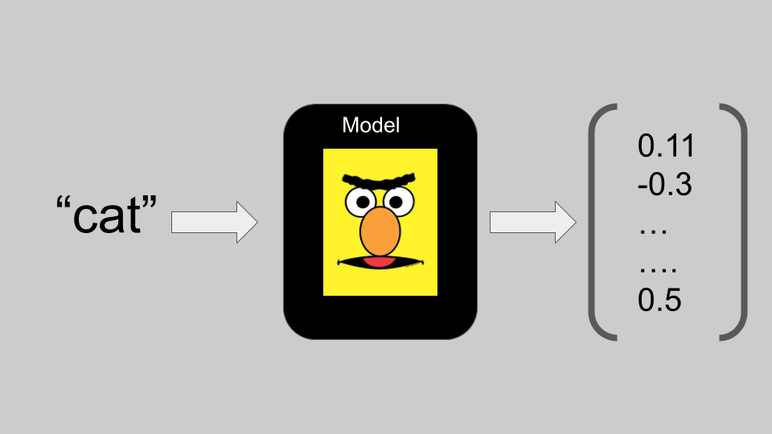
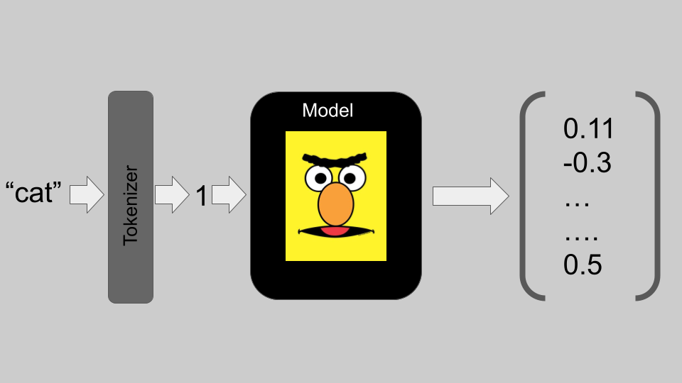

# Lab 4: Tokenizer

A basic component of all language models is a tokenizer. In this lab you will
implement a basic tokenizer, modeled on HuggingFace's tokenizer, which maps
strings to indices in a model. At the conclusion of the assignment you should
have a working class which will be used in subsequent labs and homeworks. Below,
I sketch out what a tokenizer is and the specific functionalities you will need
to implement. 

## Guiding Question

 1. How do we break text into chunks for language modeling? 

## Learning Objectives

 1. Implement a basic tokenizer 
 2. Familiarity with concepts including batching, padding, and truncating

## Outline 

- [ ] What is a tokenizer? 
- [ ] Tokenizer class
    - [ ] Class basics
    - [ ] Saving/loading tokenizers
    - [ ] TODO: String preprocessing
    - [ ] TODO: Encoding
    - [ ] TODO: Creating vocab
    - [ ] Decoding
- [ ] Testing your code

## Rubric

| function | points | 
| -------- | ------ | 
| convert\_tokens\_to\_ids | 20pts |
| create\_vocab | 20pts | 
| preprocess | 20pts |
| encode | 40pts |


## Tokenizers

For an additional overview of tokenizers, I recommend checking out the NLP
portion of HuggingFace's preprocessing
[tutorial](https://huggingface.co/docs/transformers/preprocessing). If you'd
like a sense of the range of possible tokenizers, I recommend checking out
[this](https://huggingface.co/docs/transformers/tokenizer_summary) from
HuggingFace (for your reference, we will be building a word-based tokenizer). 

In a typical modeling scenario in NLP, you'll go from text to some output (e.g.,
embeddings, probability of next words). That is, for an embedding model, we
would have the following: 



Notice, that we go from text (e.g., "cat") to a vector. That is, at some stage in our
modeling, we have to map strings to something like a number. The conversion from 
text to numbers is conventionally handled by a tokenizer. In its most basic form, 
a tokenizer simply assigns integers to strings. Modifying our above figure, we 
can imagine a tokenizer which assigns the string "cat" the integer 1. 



We will refer to the strings assigned integers as **tokens** and their
corresponding integers as **ids**. That is, so far our tokenizer has one token
("cat") which has an id of 1. In more realistic environments, however, we would
rather not assume a one-to-one mapping between inputted strings and tokens/ids.
That is, we'd like to capture that the token "cat" is contained in the longer
string "I love my cat", instead of building a tokenizer which maps "cat" to 1
and "I love my cat" to 2. 

There are many ways, we might go about breaking down strings to tokens (which
are then assigned ids). Here we will assume our tokens are words (where words is
used in the least technical sense you can imagine; i.e. we will treat "cat" and
"cats" as entirely different tokens). Typically for each input text, we apply
some preprocessing to the string (e.g., remove new line characters, lowercase
it, separate punctuation), chunk this preprocessed string into tokens, and
return the ids. You should imagine, then, a pipeline of the following sort: 


In this assignment, we will build this pipeline! Additionally, we have to
"learn" a vocabulary for our tokenizer (i.e. what token -> id mappings the
tokenizer encodes). For our simple case, this will amount to gathering all the
words from a corpus, subject to some frequency constraints. As we will not see
every possible English word in training, this learning will be incomplete. What
should we do when we encounter a token we haven't seen before? We will make use
of a special token, an unk token, which will serve as the default token in such
cases. 

## Your Tokenizer class

To get you started on building a tokenizer, I have created a class Tokenizer in
tokenizer.py which will guide your implementation. I have already implemented
part of the tokenizer, your task is to fill in the parts marked TODO.[^1] The
tokenizer class makes essential use of two objects: 

1) a dictionary called **word2idx**
2) a list called **idx2word**

The first object, word2idx, is meant to map individual tokens to their ids.  If
our tokenizer mapped the token "cat" to 0, this would mean word2idx = {"cat":
0}.  That is, word2idx["cat"] would return 0. Conversely, the second object,
idx2word, tacitly maps ids to tokens. That is, idx2word is a list of tokens
where the index of the token is that token's id. For example, setting idx2word =
["cat"] means that the token "cat" has an id of 0. The class is initialized to
have empty versions of word2idx and idx2word (e.g., word2idx = dict() and
idx2word = []). As you build your tokenizer you should make sure to use these
attributes!

[^1]: Also, each function you are to implement currently raises the error 
NotImplementedError.

Below, I provide comments for the methods for the class. The class basics have
been implemented by me and should **not** be modified. For the rest, you should
implement them in whatever order you chose, though I recommend following the
order within a block.

In addition to the comments below, the code itself gives additional hints and
example use cases of the various functions. For example, the method tokenize
includes some example output from the python interpreter:

```python
>>> from tokenizer import Tokenizer
>>> tokenizer = Tokenizer()
>>> tokenizer.tokenize("the man , who is tall , is happy !")
    ["the", "man", ",", "who", "is", "tall", ",", "is", "happy", "!"]
```

You should use these as a way of understanding the input/output of the function
and as a means of testing your code as you go.

### Class basics (implemented already)

#### \_\_init\_\_ 

The class is initialized with the default values specified in the doc string.
Additionally, self.word2idx and self.idx2word are initialized as empty. The
various attributes will become clear as you build the tokenizer.

#### \_\_len\_\_ 

This is a special method which, when set, tells python how to the built-in
function len should interact with the tokenizer. Here, I have set it to return
the number of tokens. So given an instance of the class, t, len(t) = |Vocab|. 

#### \_\_call\_\_ 

This is a special method which, when set, tells python how the class interacts
with its use as a function. Here, I have set it to call **encode** with the
class attributes. So given an instance of the class, t, t("the cat") will be the
same as t.encode("the cat") with the class attributes (e.g., padding=True). 

#### token id properties (e.g., eos\_token\_id)

You will see a few methods which are annotated with @property. This is a python
"decorator". You don't have to dig into what these are. In the case of this
class, the property decorator is used to create some additional class
attributes, namely self.unk\_token\_id, self.eos\_token\_id,
self.pad\_token\_id, and self.mos\_token\_id. That is, if you use
self.unk\_token\_id, you will get the id of the unk token.

### Saving/loading tokenizers (implemented already)

In this block, I describe a way of saving your tokenizer and loading it
from a file. This is especially helpful when you create a tokenizer from a large
file. More complex things may be desired, such as saving the
special tokens (i.e.  unk\_token, bos\_token, pad\_token, eos\_token) in a
unique way and other aspects of the class (e.g., maxSequenceLength). This is
what HuggingFace does, but for simplicity, we will just save/load the word2idx
and idx2word components of the class (i.e. the vocabulary component of the
tokenizer).

#### save\_tokenizer

This function takes as input the name of a file (as a string) which will serve
as the desired output file for the tokenizer. The format of this outputted file
is relatively straight forward: each line should contain one token and the line
number (counting from 0) should be the id of that token. 

#### load\_tokenizer

This function takes as input the name of a file (as a string) which will serve
as the desired input file. We will assume that the input file follows the format
of the output of save\_tokenizer. That is, each line in the input file has one
token, and the line number (counting from 0) is that token's id. Make sure that
you update self.word2idx and self.idx2word accordingly! 

### String preprocessing (TODO)

In this block, we will implement the first step of the pipeline described
above (preprocessing the inputted text).  The code
includes a number of examples. Below, the functions are described. 

#### TODO: preprocess

The preprocess function takes as input a string and should return a string. The
returned string will be the input string after some modifications. The
modifications you should implement are: i) separate punctuation from words with
a space, ii) lowercase the whole string (if self.lower is True), and iii) remove
any newline characters, trailing spaces, or extra spaces. For i) take care not
to separate "<" or ">". These are critical for the special tokens like "\<unk\>"
and careful with "</s>". Some hints are included in the relevant doc string.

#### tokenize

The tokenize function takes as input a string and should return the tokens in
the string. We will make a simplifying assumption that tokens are space
separated characters. So "the cats" contains two tokens ("the" and "cats").  In
other words, we assume the input to tokenize is the output of the function
preprocess.  

#### word\_tokenizer (implemented already)

The word\_tokenize function takes as input a string and returns the tokens in
the string by first applying preprocess and then tokenize. 

### Encoding (TODO)

This is likely the most challenging component of this assignment. Through it,
you will be introduced to the concept of **batches**.  

So far, we have been considering simple inputs corresponding to one input.
However, when we progress to building neural models, we can save compute time by
considering more than one input at a time. We call a group of inputs a
**batch**. Another way of thinking about the dimensions of input. Before, we
were mainly considering the sequence length holding. With batches, we are
considering two dimensions -- the number of inputs and the sequence length of
the inputs.  

Let's consider an example. Suppose we have two texts we'd like to tokenize: i)
"the cat is happy" ii) "yesterday , the cat slept all day". Suppose further that
we having the following token to id mappings: 

```
the       --> 0
cat       --> 1
is        --> 2
happy     --> 3
yesterday --> 4
,         --> 5
slept     --> 6
all       --> 7
day       --> 8
```

The encodings for the sentences on their own would be: [0, 1, 2, 3] and [4, 5,
0, 1, 6, 7, 8]. What we want is to be able to pass both texts in together and
return both encodings in one list. Namely, ['the cat is happy', 'yesterday, the
cat slept all day'] -> [[0, 1, 2, 3], [4, 5, 0, 1, 6, 7, 8]]. 

Notice, that the lengths of these two encodings are different. This is fine for
a python list, but will become a problem later in this class. To ensure equal
lengths, we could either **pad** the input or **truncate** the input. We turn to
each below.  

In **padding** a batch, we lengthen all elements of the batch to the maximum
length in the batch. That is, we will add ids to the elements in the batch, such
that they all have the same length. But what ids should we add? By convention,
we will use a pad token. We will return to the use of a pad token when we build
models, but for now it is sufficient to know that the id of pad token should be
used in lengthening an element. For example, with a pad token id of 100, we
would return [[0, 1, 2, 3, 100, 100, 100], [4, 5, 0, 1, 6, 7, 8]]. 

Conversely, in **truncating** a batch, we shorten all the elements to the
shortest length in the batch (or some other threshold). For example, we might
truncate the longer list of ids in our running examples to be the same length as
the shorter list of ids: [[0, 1, 2, 3], [4, 5, 0, 1]].

Ultimately, we may even do a mix of these, both truncating the largest elements
in a batch to some fixed length while padding the shorter elements to that size.
There could be further nuance in the way we do this. In our discussion so far,
we have padded or truncated from the right end of the list. We could use the
left end, for example. For now, we will focus on right truncation and padding.     

#### TODO: convert\_tokens\_to\_ids

The convert\_tokens\_to\_ids function takes as input either a string
(representing one token) or a list of strings (representing more than one token;
e.g., the output of the tokenize function) and returns either an int
(representing the id of one token) or a list of ints (representing the ids of
more than one token). There are no batches here, so hopefully this is
straightforward. 

#### TODO: encode

The encode function takes either a string (representing one input) or a list of
strings (representing a batch of inputs) and returns either a list of the token
ids (for one input), or a list of lists of ids (for a batch). As detailed in the
doc string, there are three additional input arguments controlling whether to
add the bos token to the beginning and eos token to the end of the text, whether
to pad to the maximum sequence length in the batch, and whether to truncate the
input if it exceeds the maxSequenceLength of the tokenizer.  Padding and
truncation should be from the right side (as described above).  Notice how you
can use the functions preprocess, tokenize, and convert\_tokens\_to\_ids in a
chain for each element of a batch to get ids! That is, all this function has to
handle itself is the type to return the ids in, padding, adding the eos token,
and truncating. For your reference, accessing other methods in the class is done
via self (e.g., to call tokenize from within another function in the same class,
you can call self.truncate(...)). 

### Creating vocab (TODO)

Recall that a tokenizer has to "learn" a vocabulary of pairs of (token, id).
For this assignment, we will learn the vocabulary by tokenizing a plain text
file and applying a frequency cutoff.  

#### TODO: create\_vocab

The function create\_vocab takes as input the name of the text file to train on
(as a string), a frequency threshold (whose default is 30), and whether to add
special tokens (whose default is set to True). In reading in the file take care
to apply the same preprocessing and tokenization that your tokenizer expects.
For example, we are adding a space before punctuation. Thus, we shouldn't learn
a complex token containing both a word and punctuation (e.g., "cat?" should be
treated as two tokens: "cat" and "?"). The frequency threshold should be used to
exclude words that do not occur more times than the threshold.  Finally, when
addSpecialTokens = True, you should ensure that the unk, bos, pad, and eos
tokens are in the model vocabulary (they might not occur in the training data). 

### Decoding (implemented already)

Given ids, it is often helpful to know what tokens are being referenced. This
task is handled by this block of code. We will make use of batches, so if you
haven't yet, read through the first part of the **Encoding** section above.  As
with encoding, decoding can be broken down into two components: i) mapping from
an id or list of ids to token(s), and ii) handling a batch of ids. The first
component is handled by convert\_ids\_to\_tokens, while the second is handled by
decode. Note that handling batches for decoding is rather straightforward
because padding, truncating, etc. is assumed to have already happen. That is
decode just maps the output of encoding back to the token strings. 

#### convert\_ids\_to\_tokens

The function convert\_ids\_to\_tokens takes as input either an int (representing
one id), or a list of ints (representing multiple ids), and returns a string or
list of strings (representing the token(s)). 

#### decode

The function decode takes as input either a list of ints (representing one
input) or a list of lists of ints (representing a batch of inputs) and returns a
list or list of lists of strings (representing the token(s)).  Notice that, for
each element in the batch, convert\_ids\_to\_tokens can be applied to yield the
tokens. 

## Testing your code

If you'd like to test your code, you can use test.py . 

```
> test.py --help
usage: test.py [-h] [--test [{create,convert,encode,preprocess,all}]]

Test your tokenizer

options:
  -h, --help            show this help message and exit
  --test [{create,convert,encode,preprocess,all}]
                        run test of create, convert, encode, preprocess, or all (default: all)
```

For example, you can test preprocess by: 

```
python test.py --test preprocess
```

## Congrats!

If you've done everything above, then you've implemented your first tokenizer!
While simpler than the models we will build in class, it is nonetheless a
crucial part of any model. If you haven't, submit your work to Moodle!
